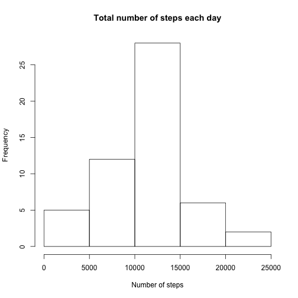
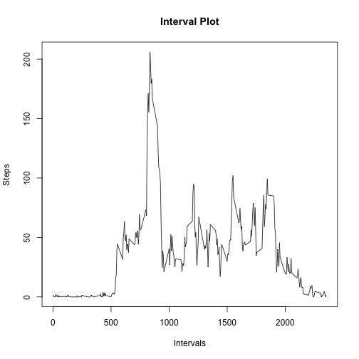
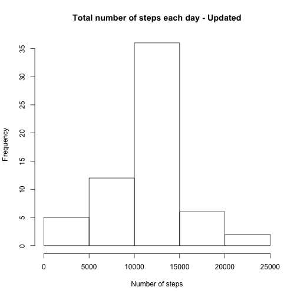
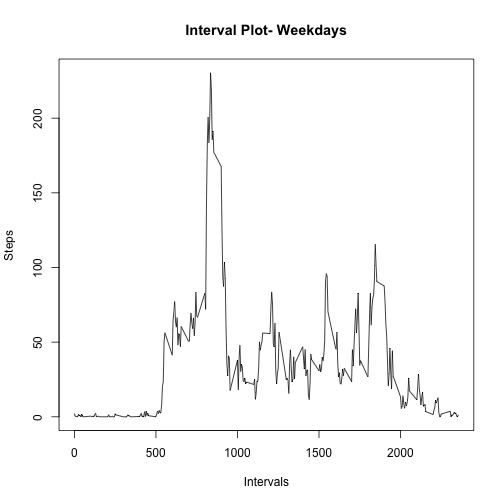
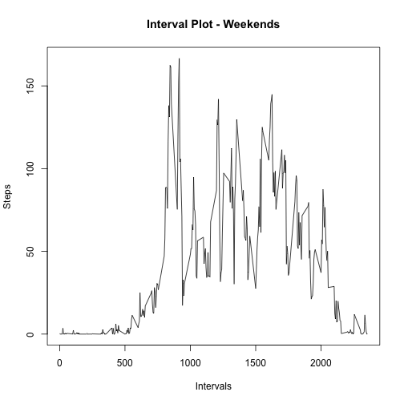

<!-- rmarkdown v1 -->
Reproducible Research - ASSIGNMENT 1
====================================

I. Loading and preprocessing the data

1.Load the data


```r
#loading the csv file
library(dplyr)
```

```
## 
## Attaching package: 'dplyr'
## 
## The following object is masked from 'package:stats':
## 
##     filter
## 
## The following objects are masked from 'package:base':
## 
##     intersect, setdiff, setequal, union
```

```r
url <- "https://d396qusza40orc.cloudfront.net/repdata%2Fdata%2Factivity.zip"
file <- file.path(getwd(),"activity.csv.zip")
if (file.exists("activity.csv.zip")) {
  doc <- read.csv(unz("activity.csv.zip", "activity.csv"))
}else {
  download.file(url, file, method = "curl")
  doc <- read.csv(unz(file, "activity.csv"))
}
```

2.Process/transform the data 
  Not necessary


II. What is mean total number of steps taken per day?

1.Calculate the total number of steps taken per day


```r
#calculating the total number of steps per day for each day
tot_steps_each_day <- aggregate(steps~date, data=doc, FUN=sum, na.rm=TRUE)
tot_steps_each_day
```

```
##          date steps
## 1  2012-10-02   126
## 2  2012-10-03 11352
## 3  2012-10-04 12116
## 4  2012-10-05 13294
## 5  2012-10-06 15420
## 6  2012-10-07 11015
## 7  2012-10-09 12811
## 8  2012-10-10  9900
## 9  2012-10-11 10304
## 10 2012-10-12 17382
## 11 2012-10-13 12426
## 12 2012-10-14 15098
## 13 2012-10-15 10139
## 14 2012-10-16 15084
## 15 2012-10-17 13452
## 16 2012-10-18 10056
## 17 2012-10-19 11829
## 18 2012-10-20 10395
## 19 2012-10-21  8821
## 20 2012-10-22 13460
## 21 2012-10-23  8918
## 22 2012-10-24  8355
## 23 2012-10-25  2492
## 24 2012-10-26  6778
## 25 2012-10-27 10119
## 26 2012-10-28 11458
## 27 2012-10-29  5018
## 28 2012-10-30  9819
## 29 2012-10-31 15414
## 30 2012-11-02 10600
## 31 2012-11-03 10571
## 32 2012-11-05 10439
## 33 2012-11-06  8334
## 34 2012-11-07 12883
## 35 2012-11-08  3219
## 36 2012-11-11 12608
## 37 2012-11-12 10765
## 38 2012-11-13  7336
## 39 2012-11-15    41
## 40 2012-11-16  5441
## 41 2012-11-17 14339
## 42 2012-11-18 15110
## 43 2012-11-19  8841
## 44 2012-11-20  4472
## 45 2012-11-21 12787
## 46 2012-11-22 20427
## 47 2012-11-23 21194
## 48 2012-11-24 14478
## 49 2012-11-25 11834
## 50 2012-11-26 11162
## 51 2012-11-27 13646
## 52 2012-11-28 10183
## 53 2012-11-29  7047
```

```r
#total number of steps 
sum(doc$steps, na.rm = TRUE)
```

```
## [1] 570608
```

2.Make a histogram of the total number of steps taken each day


```r
#plotting histogram
hist(tot_steps_each_day$steps, xlab = "Number of steps", main = "Total number of steps each day")
```

 

3.Calculate and report the mean and median of the total number of steps taken per day


```r
mean_steps_per_day <- mean(tot_steps_each_day$steps)
median_steps_per_day <- median(tot_steps_each_day$steps)
```
The mean per day is 1.0766189 &times; 10<sup>4</sup> and the median is 10765

III. What is the average daily activity pattern?

1.Make a time series plot (i.e. type = "l") of the 5-minute interval (x-axis) and the average number of steps taken, averaged across all days (y-axis)


```r
avg_interval_per_day <- aggregate(steps~interval, data=doc, FUN=mean, na.rm=TRUE)
plot(x = avg_interval_per_day$interval, y = avg_interval_per_day$steps, type = "l", xlab = "Intervals", ylab = "Steps", main = "Interval Plot")
```

 

2.Which 5-minute interval, on average across all the days in the dataset, contains the maximum number of steps?


```r
#First caluclate the maximum steps from all the interval and find the interval that relates to that maximum steps
max_steps <- max(avg_interval_per_day$steps)
cnt <- nrow(avg_interval_per_day)
for (i in 1:cnt){ 
  if (avg_interval_per_day$step[i] == max_steps) {
    max_interval <- avg_interval_per_day$interval[i]
  }   
}
```
The interval 835 has the maximum number of steps on average across all days

IV. Inputting missing values

1.Calculate and report the total number of missing values in the dataset


```r
#calculating the number of NAs in the file
total_na <- 0
count <- nrow(doc)
for (i in 1:count){ 
  if (is.na(doc$steps[i])) {
    total_na <- total_na + 1
  }
}
```
There are 2304 NAs in the activity file. 


2.Devise a strategy for filling in all of the missing values in the dataset. The strategy does not need to be sophisticated. For example, you could use the mean/median for that day, or the mean for that 5-minute interval, etc.
          and          
3.Create a new dataset that is equal to the original dataset but with the missing data filled in

```r
# all the missing values that is the NAs in the steps column has been filled with the average steps with the repective intervals. 
doc_copy_missing_filled <- doc
for (i in 1:count){ 
  if (is.na(doc_copy_missing_filled$steps[i])) {
    for (j in 1:cnt){
      if (doc_copy_missing_filled$interval[i] == avg_interval_per_day$interval[j]){
        doc_copy_missing_filled$steps[i] <- avg_interval_per_day$steps[j]
      }
    }
  }
}
```


4.Make a histogram of the total number of steps taken each day and Calculate and report the mean and median total number of steps taken per day. Do these values differ from the estimates from the first part of the assignment? What is the impact of imputing missing data on the estimates of the total daily number of steps?


```r
#Calculating the total steps each day for the updated file with missing NAs filled. 
tot_steps_each_day_copy <- aggregate(steps~date, data=doc_copy_missing_filled, FUN=sum, na.rm=TRUE)
hist(tot_steps_each_day_copy$steps, xlab = "Number of steps", main = "Total number of steps each day - Updated")
```

 

```r
#caculating the updated mean and median to check the if there are any changes
mean_steps_per_day_copy <- mean(tot_steps_each_day_copy$steps)
median_steps_per_day_copy <- median(tot_steps_each_day_copy$steps)
mean_steps_per_day_copy
```

```
## [1] 10766.19
```

```r
median_steps_per_day_copy
```

```
## [1] 10766.19
```

There are changes to median after the filling in with the missing vales.In the original file both the mean and median was the same.  After updating the file the middle point or the median has changed. 


V. Are there differences in activity patterns between weekdays and weekends?

1.Create a new factor variable in the dataset with two levels – “weekday” and “weekend” indicating whether a given date is a weekday or weekend day.


```r
library(data.table)
```

```
## 
## Attaching package: 'data.table'
## 
## The following objects are masked from 'package:dplyr':
## 
##     between, last
```

```r
#calculating the week number from the date
week <- weekdays(as.Date(doc_copy_missing_filled$date), abbreviate = FALSE)
week_day <- week
count <- nrow(doc_copy_missing_filled)
for (i in 1:count) 
{
     #the loop translates the weeknumber into a weekday or weekend. mon - fri weekday
     if(week[i] == "Saturday" || week[i] == "Sunday")
         week_day[i] <- 'weekend'
     else
         week_day[i] <- 'weekday'
}
#moving the values into a new column Weekday to the dataset 
doc_copy_missing_filled$Weekday <-week_day
```

2.Make a panel plot containing a time series plot (i.e. type = "l") of the 5-minute interval (x-axis) and the average number of steps taken, averaged across all weekday days or weekend days (y-axis). See the README file in the GitHub repository to see an example of what this plot should look like using simulated data.


```r
# the weekday and weekend files are seperated using pattern matching
weekday <- grep("weekday",doc_copy_missing_filled$Weekday)
doc_weekday <- doc_copy_missing_filled[weekday,]
doc_weekend <- doc_copy_missing_filled[-weekday,]

#avegrage steps per day during weekday and weekend in 5 minute interval

avg_interval_weekday <- aggregate(steps~interval, data = doc_weekday, FUN = mean )
avg_interval_weekend <- aggregate(steps~interval, data = doc_weekend, FUN = mean )

#plots
plot(x = avg_interval_weekday$interval, y = avg_interval_weekday$steps, type = "l", xlab = "Intervals", ylab = "Steps", main = "Interval Plot- Weekdays") 
```

 

```r
plot(x = avg_interval_weekend$interval, y = avg_interval_weekend$steps, type = "l", xlab = "Intervals", ylab = "Steps", main = "Interval Plot - Weekends") 
```

 
